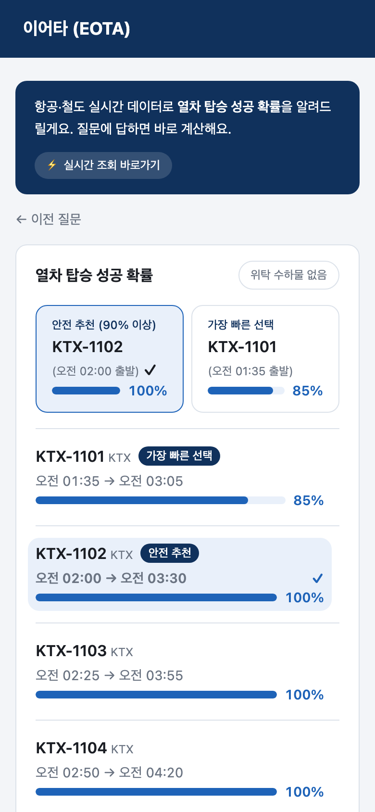
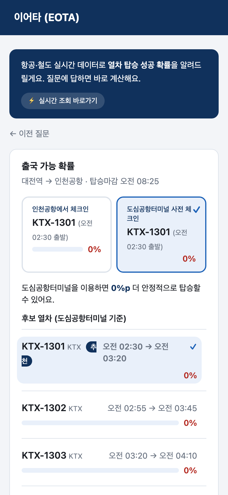

# 이어타 (EOTA)

> 항공·철도 환승의 불확실성을 “가능/불가능”이 아닌 **열차 탑승 성공 확률**로 설명하는 여행 의사결정 서비스

[](https://nextjs.org/)
[](https://www.typescriptlang.org/)
[](https://vitest.dev/)
[](https://eota-pi.vercel.app)

**내일로 해커톤 2026 출품작** · [라이브 데모](https://eota-pi.vercel.app) · [아키텍처 문서](docs/ARCHITECTURE.md)



## 문제

항공편 지연, 입국 심사, 수하물 수취, 공항철도 대기처럼 환승 과정에는 여러 불확실성이 겹칩니다. 단순히 평균 소요 시간을 더하면 배차 간격이나 지연의 꼬리 위험을 놓치고, 사용자는 왜 특정 열차가 안전한지 알기 어렵습니다.

이어타는 각 이동 단계를 확률분포로 모델링하고 10,000회 몬테카를로 시뮬레이션을 수행해 다음을 함께 제공합니다.

- 후보 열차별 탑승 성공 확률과 안전 추천
- 단계별 예상 소요 시간, 누적 시간, 확률분포 히스토그램
- 같은 열차에서 도심공항터미널 사전 체크인이 만드는 확률 차이
- 남는 시간을 활용한 대전역 주변 관광 코스와 복귀 안전 여유

## 핵심 기능

| 여정 | 계산 방식 | 사용자에게 주는 답 |
|---|---|---|
| 비행기 → 기차 | 도착 지연·입국·수하물·공항 이동을 순방향 계산 | 90% 이상인 안전 열차와 가장 빠른 열차 비교 |
| 기차 → 비행기 | 탑승 마감 시각에서 역산 | 가장 늦게 출발 가능한 열차와 사전 체크인 효과 비교 |
| 기차만 | 출발지 이동·역내 이동만 반영 | 최소 질문으로 탑승 가능성 계산 |



## 기술적 포인트

### 설명 가능한 확률 엔진

확률 계산에 LLM이나 블랙박스 모델을 사용하지 않습니다. 각 구간을 `gamma`, `normal`, `uniform`, `constant` 분포로 표현하고, 시드 기반 의사난수 생성기로 결과를 재현할 수 있게 했습니다.

```ts
const result = simulate({
  segments,
  baseTimeMin,
  deadlineMin,
  iterations: 10_000,
  seed: 42,
});
```

엔진은 성공 확률뿐 아니라 p50/p80/p95, 히스토그램, 단계별 타임라인을 한 번에 반환합니다. UI는 이 결과를 그대로 시각화해 “왜 89%인가”를 설명합니다.

### 데이터 신뢰도 공개

모수마다 `confirmed`, `needs-calibration`, `prior-only` 상태와 출처를 함께 관리합니다. 실측 근거가 부족한 값은 UI에서 **추정값**으로 표시해 데이터 공백을 숨기지 않습니다.

### 장애에 강한 어댑터 구조

공공데이터 API 키가 있으면 항공·공항 혼잡·관광 데이터를 조회하고, 키가 없거나 외부 API가 실패하면 mock 데이터로 전체 흐름을 끝까지 체험할 수 있습니다. 열차 운행 정보는 현재 공개 API 제약 때문에 mock 어댑터를 사용합니다.

## 구조

```text
src/
├── app/                 # Next.js 화면과 API route
├── components/          # 질문 카드, 결과 시각화, 관광 UI
└── lib/
    ├── adapters/        # live/mock 데이터 어댑터
    ├── chat/            # 질문 흐름, 슬롯 검증, 결과 조립
    ├── engine/          # 분포 샘플링과 몬테카를로 엔진
    └── tour/            # 시간 예산 기반 관광 코스 필터
```

세부 데이터 흐름과 설계 판단은 [아키텍처 문서](docs/ARCHITECTURE.md)에 정리했습니다.

## 로컬 실행

요구 사항: Node.js 20 이상, npm

```bash
git clone https://github.com/giho999/eota-hackathon.git
cd eota-hackathon
npm ci
npm run dev
```

브라우저에서 <http://localhost:3000>으로 접속합니다. 환경변수가 없어도 mock 모드로 동작합니다.

실데이터와 지도를 사용하려면 예시 파일을 복사해 값을 설정하세요.

```bash
cp .env.example .env.local
```

| 환경변수 | 용도 | 필수 여부 |
|---|---|---|
| `DATA_GO_KR_KEY` | 공공데이터포털 항공·혼잡·관광 API | 선택 |
| `NEXT_PUBLIC_KAKAO_MAP_KEY` | 관광 코스 카카오맵 표시 | 선택 |

## 검증

```bash
npm test       # 확률분포, 시뮬레이션, 여정 결과 테스트
npm run build  # 프로덕션 빌드 검증
```

현재 단위 테스트는 총 18개이며 다음 경계 조건을 포함합니다.

- 고정 시드에서 동일한 시뮬레이션 결과 재현
- 상수 분포와 충분한 마감 시간에서 확률 경계값 검증
- 수하물 세그먼트 제거 시 성공 확률 상승
- 기차 → 비행기 여정의 자정 경계와 역산 계산

## 더 보기

- [전체 사용자 흐름 스크린샷](docs/screenshots)
- [반응형 화면 검증](docs/screenshots/responsive)
- [배포 데모 QR](eota-qr.png)

<p align="center">
  
</p>
