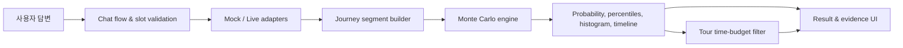

# 이어타 아키텍처

## 설계 목표

이어타의 핵심 목표는 환승 성공 확률을 계산하는 것뿐 아니라, 사용자가 결과의 근거를 단계별로 확인할 수 있게 하는 것입니다. 이를 위해 확률 엔진, 데이터 수집, 여정 조립, UI를 분리했습니다.



## 주요 구성요소

### 확률 엔진

`src/lib/engine`은 UI와 외부 API에 의존하지 않는 순수 TypeScript 모듈입니다.

- `distributions.ts`: 정규·감마·균등·상수 분포 샘플링과 시드 기반 PRNG
- `simulate.ts`: 기본 10,000회 반복, 성공 확률·백분위·히스토그램·타임라인 계산
- `params.ts`: 구간별 모수, 출처, 신뢰 상태 관리

각 시뮬레이션에서 모든 구간의 샘플 시간을 더한 뒤 마감 시각 이전에 도착한 비율을 성공 확률로 계산합니다.

```text
P(success) ≈ count(base time + Σ segment samples ≤ deadline) / iterations
```

평균 합산만으로 놓치기 쉬운 공항철도 배차 대기는 `uniform(0, headway)`로 모델링합니다.

### 여정 조립

`src/lib/chat/result.ts`가 사용자의 답변과 어댑터 결과를 여정별 세그먼트로 조립합니다.

- 유형 A는 항공 도착 시각에서 열차 출발 시각까지 순방향으로 계산합니다.
- 유형 B는 항공 탑승 마감 시각을 기준으로 후보 열차를 역산하고, 도심공항터미널 이용 여부를 각각 계산합니다.
- 유형 C는 항공 관련 세그먼트를 생성하지 않습니다.

### 데이터 어댑터

`src/lib/adapters`는 동일한 인터페이스 뒤에 live/mock 구현을 둡니다.

```text
DATA_GO_KR_KEY 있음  → LiveFlight / LiveCongestion / LiveTour
DATA_GO_KR_KEY 없음  → MockFlight / MockCongestion / MockTour
열차 데이터          → MockTrain (공개 API의 실시간성 제약)
```

외부 요청은 Next.js API route를 통과하며, 서비스 키는 서버 환경변수로만 읽습니다. 브라우저에 노출되는 값은 `NEXT_PUBLIC_KAKAO_MAP_KEY`뿐입니다.

### 관광 추천

관광 추천은 별도의 추천 모델 대신 환승 결과에서 나온 잔여 시간에 다음 제약식을 적용합니다.

```text
2 × 도보 시간 + 체류 시간 ≤ 잔여 시간 − 안전 여유
```

따라서 열차나 지연 조건이 바뀌면 관광 후보도 같은 시간 예산으로 다시 계산됩니다.

## 신뢰성과 검증

- 고정 시드로 확률 결과를 재현할 수 있습니다.
- 외부 API 키가 없어도 mock 모드로 사용자 흐름이 중단되지 않습니다.
- 모수의 출처와 확보 상태를 코드 및 UI에 함께 표시합니다.
- Vitest 단위 테스트로 분포, 시뮬레이션, 여정별 경계 조건을 검증합니다.

## 현재 제약

- 열차 운행 정보는 당일 실시간 지연을 제공하는 공개 API를 확보하지 못해 mock 데이터입니다.
- 일부 입출국·수하물 모수는 사전값이며 추가 현장 데이터로 보정이 필요합니다.
- 관광 시연 데이터는 대전역 인근으로 한정되어 있습니다.
